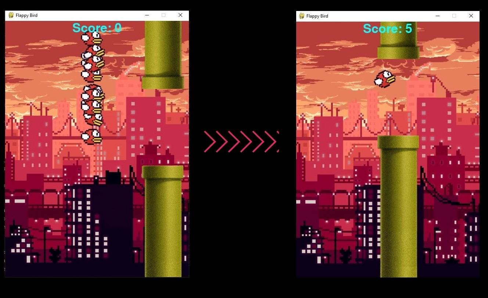

**Authors**:
* **Cristian-Ștefan Avram**
* **Ioan-Teofil Sturzoiu**
* **Sebastian Ionuț Ilinca**
* **Mihai Lățea**

**Group: 321 CA**

# Flappy Bird - AI


1. [**Introduction - NEAT**](#1-introduction---neat)
2. [**Pygame**](#2-pygame)
3. [**Challenges**](#3-challenges)
4. [**Tasks**](#4-tasks)
5. [**Running Instructions**](#5-running-instructions)

## **1. Introduction - NEAT**
This project is targeting a *Flappy Bird* application, which is training a model to play the game independently. This *AI* environs is sustained by the **NeuroEvolution of Augmenting Toplogies** algorithm, usually known as **NEAT**, a *genetic algorithm* (**GA**). By means of the latter concept, there are multiple generations of birds created. With each generation in part, the model learns about whether the bird should jump or not. The bird which survives the longest is used for reproduction and creation of a new generation $\longrightarrow$ *natural selection* (**Fig. 1**). Each generation is monitoring $100$ birds.

<center></center>
<center><b>Fig 1. - Natural Selection</b></center>

<br></br>
Behind the scenes, there is a neural network implemented with a layer of three nodes (*input layer*) and an output layer (which determines if the bird should jump or not). There are no hidden layers used for training the model. This approach would lead to **overfitting**, as there are not so many neurons given. The activation function that is used to decide whether a neuron should be activated or not is the **ReLU (Rectified Linear Unit)** function:
$$
f(x) = max(0, x)
$$
The motivation that lays behind choosing this activation function may be represented by many factors, but the most important one is the *computational simplicity*. This function only needs a *max()* function, there is no needing for computing the exponential function in activations (like in the case of using *tanh* or *sigmoid* functions). The neural network settings are stored in ```config-feedforward.txt```.

#### **Physics**
The birds' movement is simulating reality, using *mechanics* laws, like the law of motion. The bird is actually standing still on the *$O_X$* axis. Its only movement is on the *$O_Y$* axis, which is a linear motion. The following formulas where used for implementing these *laws*.
$$
    y = y_0 + v_0t + \frac{at^2}{2}\\
    v = v_0 + at
$$

## **2. Pygame**
For the implementation of the graphical interface, I've used the *pygame* module. There are no user interaction functionalities through this module, as the project is focused on training a model which is capable of playing the game by itself.

The elements that were used for creating the environment are stored in ```images/```. The background is actually a **GIF.**, which is displayed as a list of frames that are updated with every time quantum in part (stored in ```images/back_images/```).

The bird has three fundamental states in terms of character figure. I did not implemented a rotation function. Instead, I created three images, that are representative for *jumping*, *falling* or *straight* phases.

## **3. Challenges**
One of the biggest challenges that I've met in implementing this project is represented by finding the most appropiate settings that would support the a propitious environment for the model to be trained. These settings consist in: *velocity*, *acceleration*, *activation function* and the *height of jump*. There are numerous possibilities of weavering these characteristics.

## **4. Tasks**
* Cristian-Ștefan Avram - research upon the neural network settings and implemented the genetic algorithm using *NEAT* module and writed the *README.md*.
* Ioan-Teofil Sturzoiu - implemented the *Pipe* class and how collisions work and when a bird should be removed from the population. Also created a *scoring system*.
* Sebastian Ionuț Ilinca - responsible for birds' movement, implemented the laws of motion and the functions that are needed for updating a bird's position.
* Mihai Lățea - implemented the graphical interface using pygame, combined all the elements and forged them into an indie game environment.

## **5. Running Instructions**
There is a **Makefile** that is responsible for running the program, using the following command:
```bash
make run
```

Also, to install the necessary requirements (python modules - NEAT && Pygame), just use the following command:
```bash
make install
```

If there are problems in your system, check if Python3 is actually installed, using:
```bash
student@ubuntu:~$ python3 --version

> Python 3.9.13
```
